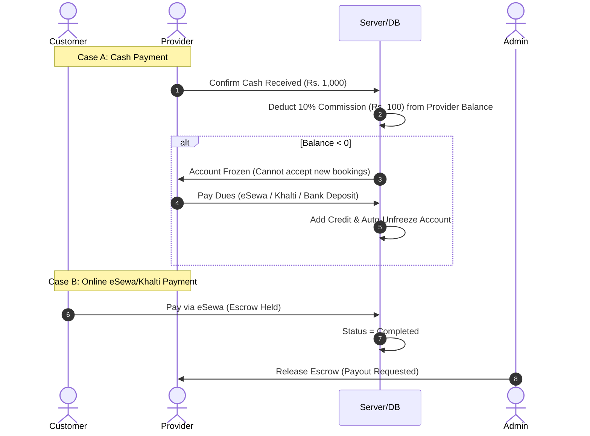

# Gharelu Sewa — Local Home Service Marketplace

Gharelu Sewa is a full-stack local service marketplace connecting households with verified, skilled local service professionals such as Plumbers, Electricians, Cleaners, AC Technicians, Tutors, and Repair Experts across Nepal.

The platform provides location-aware service matching down to municipal ward levels, real-time messaging, emergency booking dispatches, escrow-backed payment protection via eSewa and Khalti, provider KYC identity verification, and an automated commission and wallet settlement engine.


## Key Highlights & Capabilities

- Precision Ward-Based Matching and Priority Sorting
  - Location filtering by metropolitan cities (Kathmandu, Pokhara, Bharatpur) and their administrative wards.
  - Smart sorting algorithm prioritizing providers with exact ward matches first, followed by numerical proximity for geographic matching.

- Multi-Mode Payment and Escrow Protection
  - Integrated digital payments via eSewa with HMAC-SHA256 signature verification and Khalti.
  - Platform Escrow System: Customer payments are held safely until service completion and customer satisfaction.
  - Cash-on-delivery tracking with automatic 10% platform commission deduction from provider wallets.

- Wallet Dues Settlement and Auto-Freezing Engine
  - Automated tracking of provider balances. Cash transactions deduct 10% commission.
  - Negative balance threshold auto-freezes provider job acceptance until dues are settled.
  - Self-service Dues Settlement Portal for providers allowing instant unfreezing via eSewa, Khalti, or Direct Bank Transfer.

- Synchronized Rating and Review System
  - Transactional ACID review creation with automatic bad word filtering.
  - Dynamic mathematical recalculation of average ratings (`rating_avg`) and review counts (`total_reviews`), instantly reflected on professional profiles.

- Mandatory Provider KYC and Admin Control
  - Two-tier verification requiring citizenship numbers and photo document uploads.
  - Comprehensive Admin Portal for managing users, approving/rejecting KYC applications, releasing escrow funds, managing categories, and exporting CSV reports.

- Real-Time Notifications and Tracking
  - WebSockets powered by Socket.IO for instant messaging, status change alerts, and live tracking map.


## Architecture & Technology Stack

### Technology Stack

| Layer | Technology / Tools |
| :--- | :--- |
| Frontend | React 18 (Vite), Tailwind CSS, Lucide Icons, React Router v6, Axios, Socket.IO-client |
| Backend | Node.js, Express.js, Socket.IO, JWT (JSON Web Tokens), bcryptjs |
| Database | PostgreSQL (Node-Postgres `pg` pool) |
| Payment Gateway | eSewa Gateway (EPAY v2 with HMAC-SHA256 signature validation), Khalti, Platform Escrow |
| Deployment | Vercel (Frontend), Render / Railway (Backend), Supabase / Managed PostgreSQL (Database) |


### Repository Structure

```
gharelu-sewa/
├── backend/
│   ├── src/
│   │   ├── config/          # Database connection & initial migration scripts
│   │   ├── controllers/     # Business logic (Auth, Bookings, Payments, Reviews, Admin, Dues)
│   │   ├── middleware/      # JWT auth guard, role-based authorization
│   │   ├── routes/          # Express REST API routes
│   │   ├── utils/           # HMAC eSewa validation, password hashing, bad word filter
│   │   └── server.js        # Server entry point & Socket.IO initialization
│   ├── .env.example
│   └── package.json
│
├── frontend/
│   ├── src/
│   │   ├── components/      # Shared UI elements (Navbar, Footer, Modals, Ward Selector)
│   │   ├── context/         # AuthContext (global authentication state)
│   │   ├── pages/           # Page views (Customer, Provider, Admin portals)
│   │   │   ├── admin/       # Dashboard, Manage Users, Pending KYC, Payouts, Bookings
│   │   │   ├── customer/    # Browse Services, Booking Wizard, Emergency, Details, Tracking
│   │   │   └── provider/    # Provider Dashboard, Earnings & Dues Settlement, Profile
│   │   ├── services/        # Centralized Axios API client & Socket listeners
│   │   ├── App.jsx          # Main application & Protected Routes
│   │   └── main.jsx         # React application entry point
│   ├── public/              # Brand assets & static images
│   ├── .env.example
│   └── package.json
│
└── README.md
```


## Quick Start & Local Setup

### Prerequisites

- Node.js v18.0.0 or higher
- npm v9.0.0 or higher
- PostgreSQL v14.0 or higher (running locally or managed database instance)


### 1. Backend Installation & Database Setup

```bash
# Navigate to backend directory
cd backend

# Install dependencies
npm install

# Create environment configuration file
cp .env.example .env
```

Configure environment variables in `backend/.env`:

```env
PORT=5000
NODE_ENV=development
FRONTEND_URL=http://localhost:5173

# Database Configuration
DB_HOST=localhost
DB_PORT=5432
DB_NAME=gharelu_sewa
DB_USER=postgres
DB_PASSWORD=your_db_password

# Authentication & Security
JWT_SECRET=your_jwt_secret_key

# Payment Gateway Configuration
ESEWA_MERCHANT_CODE=EPAYTEST
ESEWA_SECRET_KEY=your_esewa_secret_key
```

Initialize the database tables and seed data:

```bash
# Start backend server in development mode
npm run dev
```

The backend API server will run on `http://localhost:5000`.


### 2. Frontend Setup

```bash
# Navigate to frontend directory
cd frontend

# Install dependencies
npm install

# Create environment configuration file
cp .env.example .env
```

Configure `frontend/.env`:

```env
VITE_API_URL=http://localhost:5000/api
VITE_SOCKET_URL=http://localhost:5000
```

Start the development server:

```bash
npm run dev
```

The frontend application will be accessible at `http://localhost:5173`.


## System Workflows & Core Logic

### 1. Commission & Wallet Dues Settlement Model




### 2. Ward-Based Location Prioritization System

When a customer searches for service providers in a specific city ward:

1. Tier 1 Priority: Service providers who explicitly selected that exact ward in their coverage settings.
2. Tier 2 Priority: Providers with the lowest numerical ward assigned for proximity ranking.
3. Tier 3 Priority: City-wide fallback coverage providers.


## REST API Reference

### Authentication & Profile

- `POST /api/auth/register` — Register a customer or service provider account
- `POST /api/auth/login` — Authenticate and receive JWT token
- `GET /api/auth/me` — Retrieve current authenticated user session
- `POST /api/auth/reverify-kyc` — Re-submit KYC identification documents

### Services & Service Providers

- `GET /api/categories` — Fetch all service categories (Plumbing, Electrical, etc.)
- `GET /api/users/providers` — List service providers with city/ward and rating filters
- `GET /api/users/providers/:id` — Retrieve detailed provider profile

### Bookings & Emergency Flow

- `POST /api/bookings` — Create a standard booking request with detailed ward/landmark info
- `POST /api/bookings/emergency/create` — Dispatch emergency service request
- `GET /api/bookings` — Get list of user bookings
- `PATCH /api/bookings/:id/status` — Update booking status (`accepted`, `in_progress`, `completed`, `cancelled`)

### Payments & Dues Settlement

- `POST /api/payments/initiate/:bookingId` — Initiate digital payment with eSewa HMAC validation
- `GET /api/payments/verify` — eSewa callback verification endpoint
- `POST /api/payments/cash/:bookingId` — Record cash payment and auto-deduct 10% commission
- `POST /api/providers/settle-dues` — Settle negative wallet balance and unfreeze account

### Reviews & Rating

- `POST /api/reviews` — Submit review for a completed booking and recalculate provider rating
- `GET /api/reviews/provider/:id` — Get provider review list and stats

### Admin Portal

- `GET /api/admin/stats` — Platform metrics summary
- `GET /api/admin/providers/pending` — List pending KYC applications
- `PATCH /api/admin/providers/:userId/verify` — Approve provider KYC application
- `GET /api/admin/payouts` — Review provider payout requests
- `GET /api/admin/bookings/export` — Export platform bookings report as CSV


## Database Entity Schema

The database consists of relational tables optimized with indexes:

- `users`: User identity, roles (`customer`, `provider`, `admin`), email, password hash, phone, city/ward, verification status.
- `provider_profiles`: Skill badges, hourly rates, citizenship number, KYC document URLs, rating average (`rating_avg`), total reviews, wallet balance.
- `bookings`: Booking schedule, total price, ward, street address, landmark, emergency flag, status state machine.
- `reviews`: Ratings (1-5 stars), text feedback, customer photo attachments, completion flags.
- `payments`: Payment method (`esewa`, `khalti`, `cash`), transaction reference, amount, commission, escrow release status.
- `dues_settlements`: Provider commission dues payment records and method references.
- `messages`: Real-time chat history for active bookings.
- `notifications`: System alerts and notification status logs.


## Security Features & Best Practices

- JWT Token Authentication: Bearer tokens with expiration for protected API endpoints.
- Password Security: Salted password hashing using `bcryptjs`.
- Role-Based Authorization: Middleware guards restricting endpoints to authorized roles (`customer`, `provider`, `admin`).
- HMAC SHA-256 Signatures: Secure payment verification against eSewa API tampering.
- Profanity Filter: Server-side validation against inappropriate text in reviews.
- Database Transaction Security: ACID transactions (`BEGIN`/`COMMIT`/`ROLLBACK`) for review creation and rating recalculations.
- Environment Isolation: Sensitive keys (JWT secrets, API credentials, Database passwords) stored strictly in `.env` files and never committed to version control.


## Build & Production Deployment

### Frontend Build

```bash
cd frontend
npm run build
```

Generates an optimized production build artifact in `frontend/dist`.


### Deployment Guidelines

- Frontend: Deploy `frontend/dist` to Vercel or Netlify with single-page application (SPA) rewrite rules.
- Backend: Deploy Node/Express server to Render, Railway, or AWS EC2.
- Database: Host PostgreSQL on Supabase or Render Managed Postgres.


## License & Credits

This project is released under the MIT License.

Developed for Gharelu Sewa local service platform. All rights reserved.